# Aula #1

### Probabilidade x Chance (odds)

Probabilidade
- p: probabilidade do evento
- 1-p: probabilidade do não evento

Chance = $\frac {p} {1-p}$

Exemplos: 
- p = 0.80
- chance = $\frac {4} {1} = 4$
- probabilidade do evento \ probabilidade do não evento

---
### Expressão da Logística Binária
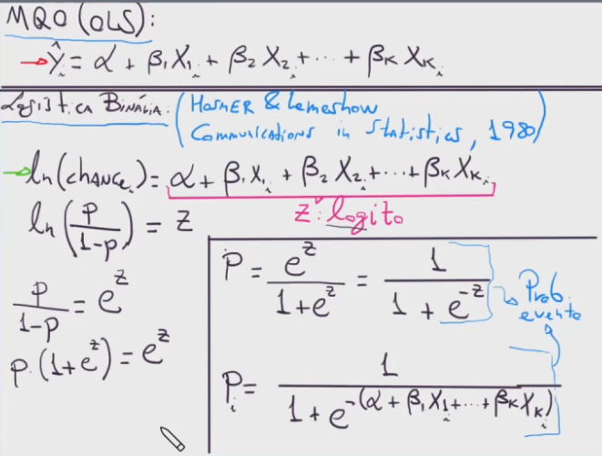

- e: número de Euler / Napier
- Napier é considerado o descobridos de logaritmos
- ~ 2,71828

### Logito
Logito: logaritmo natural da chance de ocorrência
de uma resposta do tipo “sim”.

E, a partir do logito, define-se a expressão da probabilidade de ocorrência do evento em estudo, em função das variáveis explicativas.

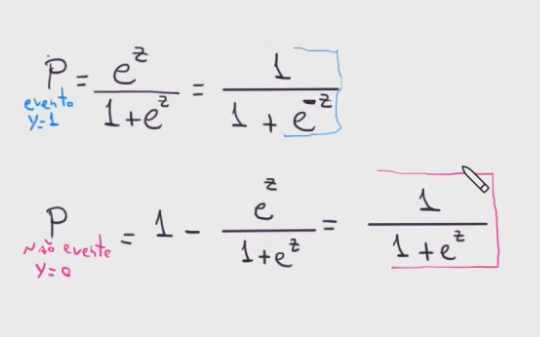

>[!warning] cuidado com o sinal do 'z' no expoente.
> Ele define se é para evento ou não evento

### O que vamos avaliar no modelo
na variável 'atrasado', temos:
- probabilidade do evento (y = 1), em função de 'dist' e 'sem'
- utilizaremos a fórmula da logística
- estimar $\alpha$, $\beta 1$, $\beta 2$...

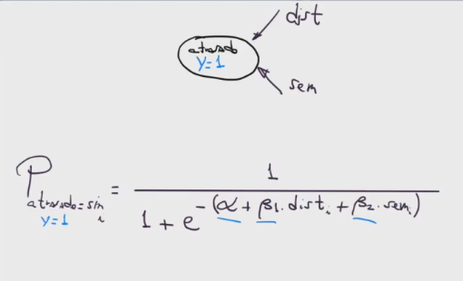

### LL
A somatório de LogLik é um indicador de eficiência do modelo

- varia de -$\infty$ a 0, quanto mais próximo de zero, melhor

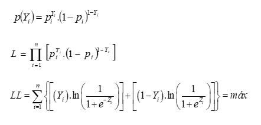

> O bom profissional não é aquele que decora tudo, é aquele que sabe que existe a resposta para algo e sabe onde procurar

### Estatística Z de Waldi
Foi um dos principais professores de econometria

Trabalhou na equipe estatística que tinha como objetivo estudar as áreas para reforço da fuselagem dos aviões durante a 2a Guerra

QUal foi a sacada dele?
Ao invés de reforçar onde apareciam os tiros, e mesmo assim os aviões retornaram, ele chamou a atenção para reforçar onde não tinha sido atingido, pois provavelmente os aviões que não retornaram tomaram tiro nestas áreas e cairam.

### LLR (Likelihood Ratio) p-value

- is used to assess the significance of the model as a whole 
- The test compares the likelihood of the full model (with all predictors) to the likelihood of a reduced model (with no predictors, i.e., the intercept-only model)
- it measures the probability of obtaining the observed (or more extreme) difference in likelihood between the full and reduced models by chance

**Interpretation:**

- A small p-value (≤ 0.05) indicates that the observed difference in likelihood between the full and reduced models is statistically significant. 
- This suggests that the full model (with predictors) is a better fit to the data than the reduced model (with no predictors).

**Practical interpretation:**

- The tiny p-value suggests that the logistic regression model with predictors is a significantly better fit to the data than a model with no predictors
- In other words, the model with predictors is doing a much better job of predicting the outcome variable than a model with no predictors.
- Keep in mind that this p-value only indicates the overall significance of the model, not the significance of individual predictors.
- To assess the significance of individual predictors, you'll need to examine the p-values associated with each predictor's coefficient in the model.

### Pseudo R-squared: McFadden

- Pseudo R-squared measures the proportion of variation in the dependent variable (outcome) that is explained by the independent variables (predictors) in the logistic regression model. 
- Unlike traditional R-squared, pseudo R-squared values are not bounded between 0 and 1, and their interpretation is not as straightforward.

**Interpretation:**

- A value close to 0 indicates that the model does not explain much of the variation in the outcome variable.
- A value close to 1 indicates that the model explains a large proportion of the variation in the outcome variable.

A low pseudo R-squared value can indicate:

- The outcome variable is complex and influenced by many factors not included in the model.
- The predictors in the model are not strong predictors of the outcome variable.
- The model is not well-specified (e.g., missing important interactions or non-linear effects).

Keep in mind that pseudo R-squared is just one of many model evaluation metrics. You should consider other metrics, such as the LLR p-value, accuracy, precision, recall, and ROC-AUC, to get a more comprehensive understanding of your model's performance.

### AIC e BIC
Não aparecem nos outputs do Python, mas são importantes para comparar os modelos

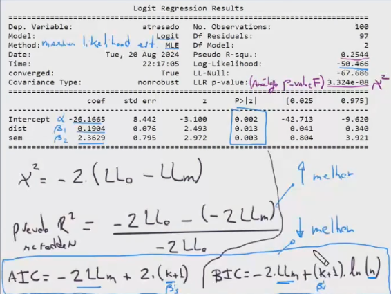

BIC and AIC are two popular metrics used to evaluate the quality of a statistical model. They're both used to compare models, but they have slightly different focuses.

**What do BIC and AIC stand for?**

* BIC: Bayesian Information Criterion
* AIC: Akaike Information Criterion

**What do they measure?**

Both BIC and AIC are measures of model fit that balance the trade-off between model complexity and model accuracy. They're used to evaluate the relative quality of a model by considering the following:

1. **Model fit**: How well does the model explain the data?
2. **Model complexity**: How many parameters does the model have?

**How are BIC and AIC calculated?**

The calculations for BIC and AIC are similar, but with a few key differences:

* AIC (Akaike Information Criterion):
	+ AIC = 2k - 2ln(L)
	+ where k is the number of parameters in the model, and ln(L) is the log-likelihood of the model
* BIC (Bayesian Information Criterion):
	+ BIC = k \* ln(n) - 2ln(L)
	+ where k is the number of parameters in the model, n is the sample size, and ln(L) is the log-likelihood of the model

**Interpretation**

Lower values of AIC and BIC indicate better model fit. However, the interpretation of the values is slightly different:

* AIC:
	+ A lower AIC value indicates a better balance between model fit and model complexity.
	+ AIC is generally used for model selection, where the goal is to choose the best model among a set of candidates.
* BIC:
	+ A lower BIC value indicates a better fit of the model to the data, while penalizing models with too many parameters.
	+ BIC is generally used for model selection, but it's more conservative than AIC, meaning it tends to prefer simpler models.

**Key differences**

* AIC is more focused on model selection, while BIC is more focused on model evaluation.
* AIC is more liberal, meaning it tends to prefer more complex models, while BIC is more conservative, meaning it tends to prefer simpler models.

**Your values**

I don't see your actual BIC and AIC values, but I can give you some general guidelines:

* If the difference in AIC or BIC values between two models is:
	+ Less than 2: The models are roughly equivalent.
	+ Between 2 and 7: The model with the lower value is slightly better.
	+ Greater than 7: The model with the lower value is significantly better.

### Matriz de confusão
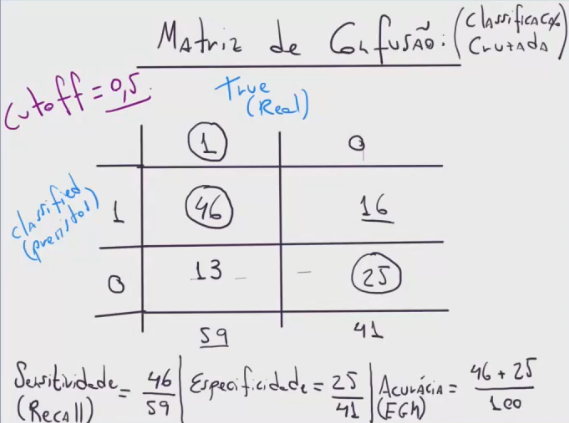

Outuputs:
**Sensitividade (True Positive Rate ou Recall)**
- taxa de acerto dos eventos
- mede a proporção de verdadeiros positivos (TP) que foram corretamente classificados pelo modelo
- Sensitividade = TP / (TP + FN)
- quanto mais alto, melhor o modelo detecta positivos reais

**Especificidade**
- taxa de acerto dos não eventos
- mede a proporção de verdadeiros negativos (TN) que foram corretamente classificados pelo modelo
- Especificidade = TN / (TN + FP)

**Acurácia (Accuracy) ou EGM (eficiência global do modelo)**
- mede a proporção de classificações corretas (TP + TN) em relação ao total de casos (TP + TN + FP + FN)
- Acurácia = (TP + TN) / (TP + TN + FP + FN)

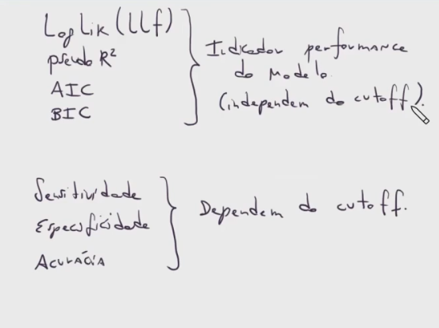

---
# Aula #2 

O tipo de dados que temos pra Y e X definem o tipo de modelo que podemos utilizar.

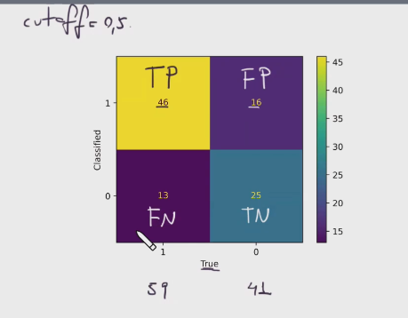

**Precision**
- TP / (TP + FP)
- mede a proporção de verdadeiros positivos (TP) em relação ao total de casos positivos previstos pelo modelo
- é a capacidade do modelo de evitar falsos positivos

**F1 Score**
- medida que combina a precisão e a sensibilidade em uma única métrica
- Fórmula: F1 Score = 2 * (Precisão * Sensibilidade) / (Precisão + Sensibilidade)
- útil quando você precisa avaliar o desempenho do modelo em uma única métrica, em vez de considerar a precisão e a sensibilidade separadamente
- especialmente útil em problemas de classificação desequilibrados, onde a precisão pode ser alta, mas a sensibilidade baixa, ou vice-versa

>[!WARNING] Considerar estes valores para determinado cutoff!

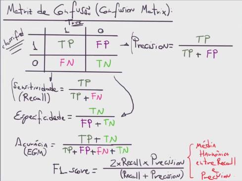

Qual o cutoff ideal?

Depende muito do tipo de mercado. No mercado financeiro, para aprovação de crédito, por exemplo, varia de região, objetivo do gestor, etc...

### Curva ROC (Receiver Operating Characteristic)
A curva ROC é um gráfico que relaciona a taxa de verdadeiros positivos (TP) com a taxa de falsos positivos (FP) em diferentes limiares de classificação. O eixo x representa a taxa de falsos positivos (FP) e o eixo y representa a taxa de verdadeiros positivos (TP).

A curva ROC pode ser interpretada da seguinte forma:

- A área sob a curva (AUC) representa a capacidade do modelo de distinguir entre as classes. Um AUC de 1 indica que o modelo é perfeito, enquanto um AUC de 0,5 indica que o modelo é aleatório.
- A curva ROC pode ser dividida em quatro regiões:

    - Região superior esquerda: alta sensibilidade e alta especificidade.
    - Região inferior direita: baixa sensibilidade e baixa especificidade.
    - Região superior direita: alta sensibilidade e baixa especificidade.
    - Região inferior esquerda: baixa sensibilidade e alta especificidade.

- A curva ROC pode ser usada para comparar o desempenho de diferentes modelos.

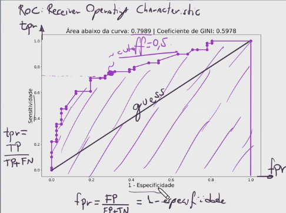

**GINI**
- GINI = (ROC - 0.5) / 0.5
- medida que calcula a área entre a curva ROC (Receiver Operating Characteristic) e a linha de referência (45°)
- usada para avaliar a capacidade de um modelo de classificação de distinguir entre as classes
- especialmente útil para problemas de classificação binária, onde a relação entre as classes é desigual

### Indicadores visto em aula (resumo)
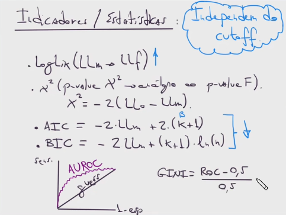

> Threshold é o mesmo que cutoff

Não necessariamente você escolhe o cutoff com base no gráfico, mas ele é o input e não output para esta análise.

## Exemplo 2 - Challenger
Livro: Robert Clemen - making hard decisions

## Exemplo 3 - Dados Fidelidade
