## Modelagem multinível
Aula: Supervised Machine Learning: Modelagem Multinível I

Capítulos 15 e 16 do livro "Manual de Análise de Dados"

---
Nomes para este modelo:
- modelos multinível
- modelos hierárquicos
- HLM (hierarchical linear models)
- Mixed models
- GLLAMM (generalized linear and latent multi models)
- Nested Models (aninhados)
- RCM (random coefficient models)


> Existem os aninhamentos perfeitos e os cruzados


### Estrutura multinível - conceito

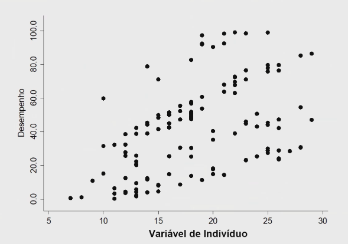
- cada aluno é um ponto no gráfico
- variável do aluno (horas estudou)


O que é mais fácil fazer?
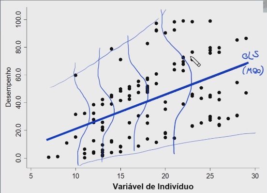
OLS / MQO!

Mas cuidado com o tamanho dos erros!

Mas e se observarmos o nível de cada escola?
- os termos de erro tendem a ser menores
- o nível 2, nível contextual revela algo diferente

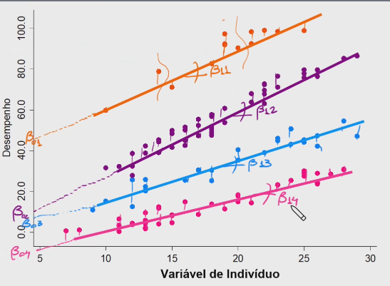
- no lugar de alfa, vamos chamar de beta 0

Quais características de escola faz com que o desempenho dos alunos uma saiam na frente em relação a outra (beta zero)?
- será que as variâncias são estatisticamente diferente de zero?

>[!warning] A dummização só garante a variância de intercepto porque as retas são paralelas, ou seja, não é possível verificar a inclinação (slope)

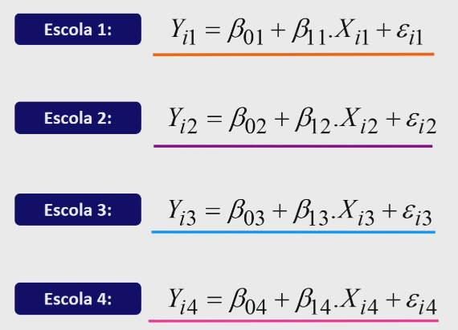
- a diferença do OLS é que temos o $\epsilon$ subscrito (erro)

>[!WARNING] Paradóxo de Simpson
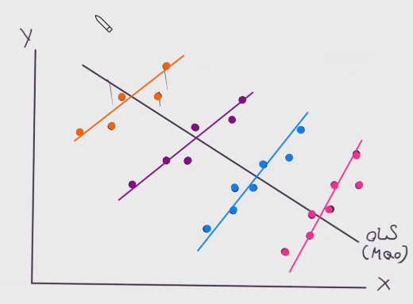
- uma tendência pode desaparecer quando os dados são combinados
- o mesmo conjunto de dados podem mostrar uma tendência oposta
- quando eu não levo em conta as perspectivas


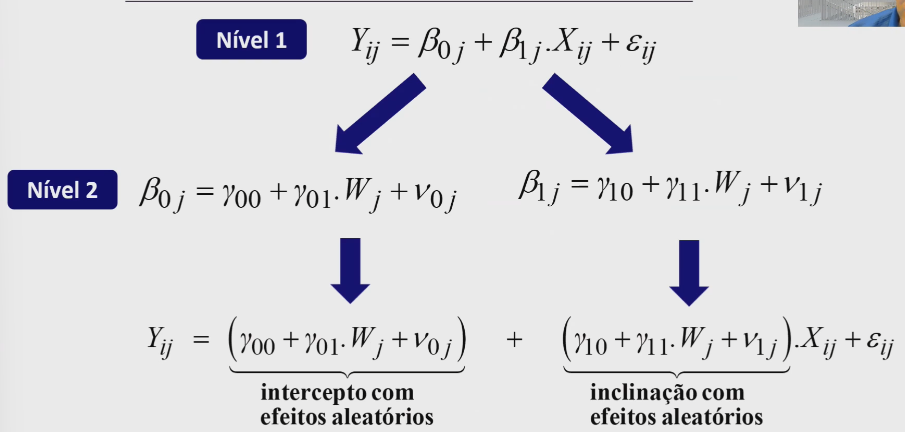
- intercepto com efeitos aleatórios apresenta variancia estatisticamente significantes?
- inclinação (slope) com efeitos aleatórios apresenta variancia estatisticamente significantes?

- componente de efeitos fixos
- componente de efeitos aleatórios

> Os modelos tradicionais de regressão ignoram as interações entre variáveis no componente de efeitos fixos e as interações entre termos de erro e variáveis no componente de efeitos aleatórios.
Harvey Goldstein

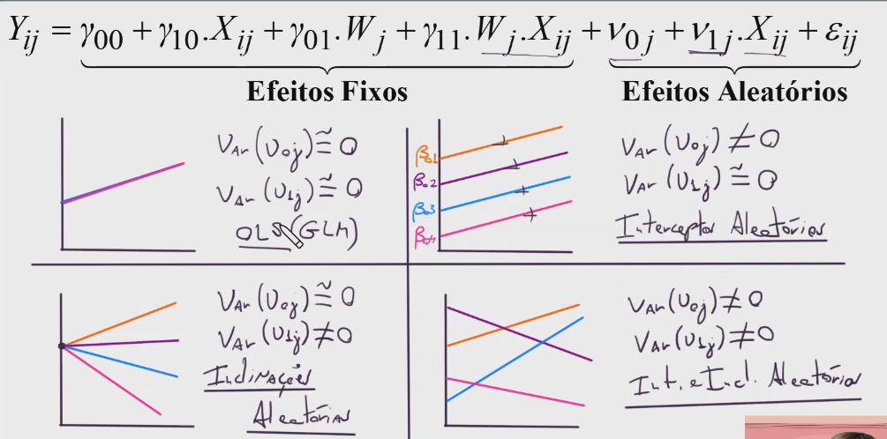


> http://mfviz.com/hierarchical-models/

This project was built by Michael Freeman, a faculty member at the University of Washington Information School

> Apenas a inserção de dummies de grupo não capturaria os efeitos contextuais, visto que não permitiria que se separassem os efeitos observáveis dos não observáveis sobre a variável dependente.
Sophia Rabe-Hesketh / Anders Skrondal

> Os modelos multinível permitem, portanto, o desenvolvimento de novos e mais bem elaborados constructos para predição e tomada de decisão. “Dentro de uma estrutura de modelo com equação única, parece não haver uma conexão entre indivíduos e a sociedade em que vivem. Neste sentido, o uso de equações em níveis permite que o pesquisador ‘pule’ de uma ciência a outra: alunos e escolas, famílias e bairros, firmas e países. Ignorar esta relação significa elaborar análises incorretas sobre o comportamento dos indivíduos e, igualmente, sobre os comportamentos dos grupos. Somente o reconhecimento destas recíprocas influências permite a análise correta dos fenômenos.”
Daniel Courgeau


---
Caso contextos não sejam observados inicialmente, podemos utilizar a clusterização inicialmente para definir contextos latentes para termos os níveis.

---
## Rodando a aula no df desempenho_aluno_escola.csv

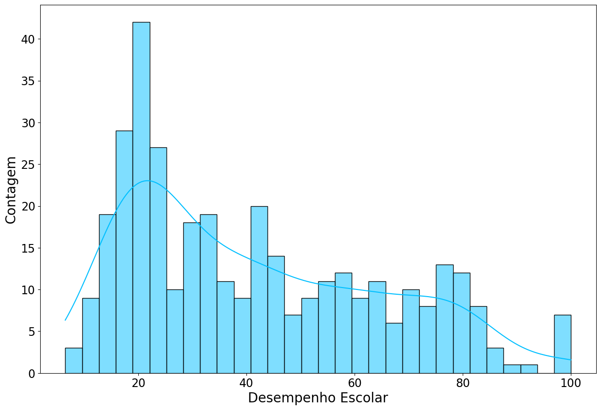
Aqui podemos até cair na tentação de aplicar o boxcox né? Porém vamos continuar na análise deste banco de dados.

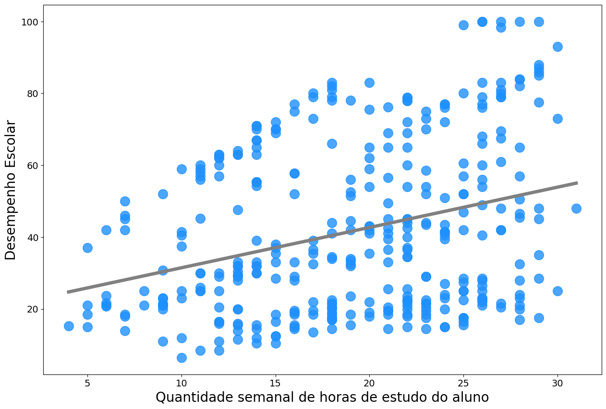
Na valiação de desempenho x horas (OLS) temos uma encrenca.

### Estimação do modelo nulo HLM2
Não existe stepwise para modelos multinível, pois levamos em conta os efeitos fixos e aleatórios.

### Step-up strategy
*O Que é a Step-Up Strategy?*
A step-up strategy é uma metodologia de construção de modelos que segue um processo incremental, adicionando componentes ao modelo em etapas sucessivas. No contexto de modelos multinível, isso geralmente significa começar com um modelo básico e adicionar gradualmente termos fixos e aleatórios conforme necessário para melhorar o ajuste do modelo e refletir a estrutura hierárquica dos dados.
Etapas da Step-Up Strategy em Modelos Multinível

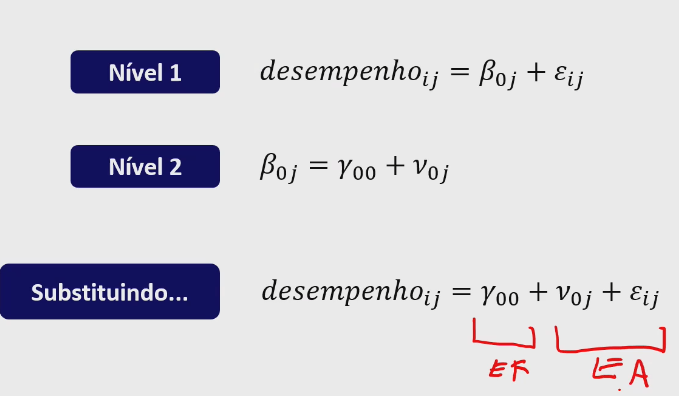

### 1. Modelo Nulo (Sem Efeitos Fixos ou Aleatórios):
- Objetivo: Servir como ponto de partida.
- Descrição: Este modelo inclui apenas a média geral dos dados, sem considerar variações entre os níveis hierárquicos.
- Fórmula Genérica:
    $Yij=γ00+ϵij$
    - $Yij$​ é a resposta para a observação $j$ no grupo $i$.
    - $γ00$​ é a média geral.
    - $ϵij$​ é o erro residual, ou idiossincrático.

**ICC = intraclass correlation do modelo nulo**
o ICC avalia a semelhança ou consistência das observações dentro do mesmo grupo comparado às observações de diferentes grupos.

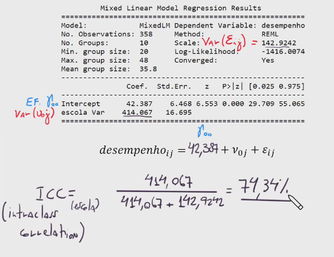
74,34% do resultado é referente ao efeito escola

### 2. Adicionar Efeitos Aleatórios:
- Objetivo: Capturar a variabilidade entre os grupos (nível superior).
- Descrição: Introduz um intercepto aleatório para cada grupo, permitindo que a média do grupo varie em torno da média geral.
- Fórmula Genérica:
    $Y_{ij}=γ_{00}+u_{0i}+ϵ_{ij}$
    - $u_{0i}$​ é o efeito aleatório para o grupo $i$.

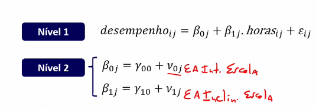

$𝑑𝑒𝑠𝑒𝑚𝑝𝑒𝑛ℎ𝑜_{𝑖𝑗} = 𝛾_{00} + 𝛾_{10}.horas_{𝑖𝑗} + 𝜈_{0𝑗} + 𝜈_{1𝑗}.ℎ𝑜𝑟𝑎𝑠_{𝑖𝑗} + 𝜀𝑖𝑗$

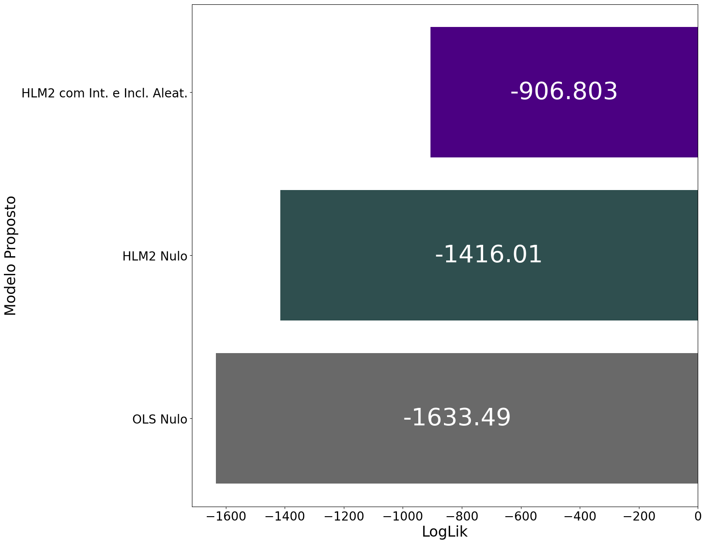
O que contribuiu para este ganho?
- a significância estatística dos efeitos aleatórios de inclinação
- a inserção da variável 'horas' no componente de efeito fixo

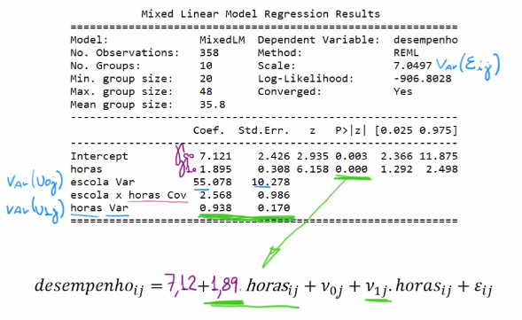

### 3. Incluir Efeitos Fixos:
- Objetivo: Avaliar o impacto de variáveis explicativas nos níveis apropriados.
- Descrição: Adicionar variáveis independentes que explicam a variabilidade na resposta.
- Fórmula Genérica:
    $Yij=γ00+γ10Xij+u0i+ϵij$
    - $Xij$​ é uma variável preditora no nível individual
    - $γ10$​ é o coeficiente associado a $Xij$
 
### Modelo final
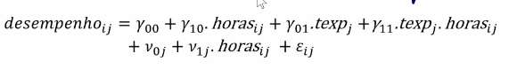

$𝑑𝑒𝑠𝑒𝑚𝑝𝑒𝑛ℎ𝑜_{𝑖𝑗} = 𝛾_{00} + 𝛾_{10}.horas_{𝑖𝑗} + 𝛾_{01}.texp_{𝑗} + γ_{11}.texp_{𝑗}.ℎ𝑜𝑟𝑎𝑠_{𝑖𝑗} + 𝜈_{0𝑗} + 𝜈_{1𝑗}.ℎ𝑜𝑟𝑎𝑠_{𝑖𝑗} + 𝜀𝑖𝑗$

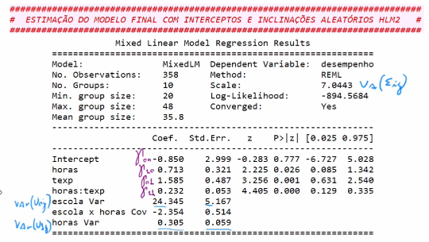

$𝑑𝑒𝑠𝑒𝑚𝑝𝑒𝑛ℎ𝑜_{𝑖𝑗} = -0,85 + 0,713.horas_{𝑖𝑗} + 1,585.texp_{𝑗} + 0,232.texp_{𝑗}.ℎ𝑜𝑟𝑎𝑠_{𝑖𝑗} + 𝜈_{0𝑗} + 𝜈_{1𝑗}.ℎ𝑜𝑟𝑎𝑠_{𝑖𝑗} + 𝜀𝑖𝑗$

Gráfico para visualização do comportamento dos valores de v0j, ou seja, dos interceptos aleatórios por escola

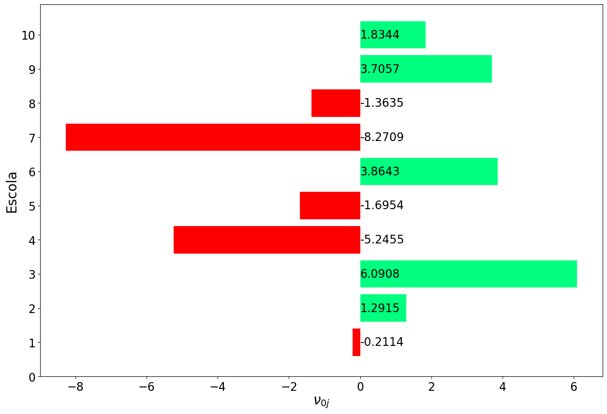
A escola 7 já começa lá atrás, quando avaliamos v0j (interceptos aleatórios).

Gráfico para visualização do comportamento dos valores de v1j,
ou seja, das inclinações aleatórias por escola


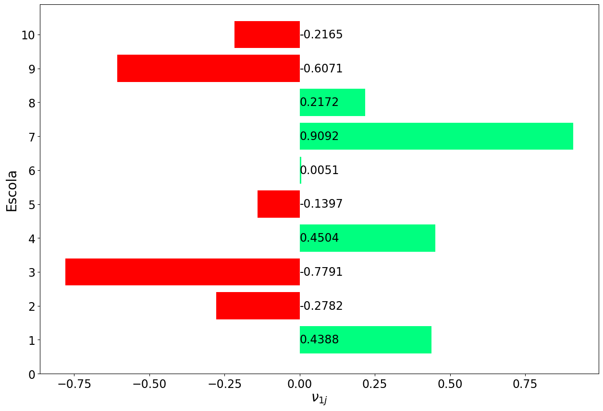
Quando observamos as inclinações aleatórios v1j, a experiência do professor compensa em muito a escola avaliada anteriormente (7).

### Predict
Se rodarmos apenas o `modelo_final_hlm2.predict()` vamos obter o fitted fixed, que corresponde a  
$𝑑𝑒𝑠𝑒𝑚𝑝𝑒𝑛ℎ𝑜_{𝑖𝑗} = 𝛾_{00} + 𝛾_{10}.horas_{𝑖𝑗} + 𝛾_{01}.texp_{𝑗} + γ_{11}.texp_{𝑗}.ℎ𝑜𝑟𝑎𝑠_{𝑖𝑗}


>[!WARNING] Para realizar a predição, precisamos encontrarmos o fitted values (fitted completo).

```python
df_aluno_escola['fitted.fixed'] = pd.DataFrame(modelo_final_hlm2.predict())
df_aluno_escola['fitted.completo'] = modelo_final_hlm2.fittedvalues
```

Exemplo:
```python
resultado_fixo = modelo_final_hlm2.predict(pd.DataFrame({'horas':[11],
                                                         'texp':[3.6],
                                                         'escola':['1']}))
resultado_fixo
```

`Output: 0   21.885819`

```python
resultado_completo = resultado_fixo + efeitos_aleatorios['v0j'][0] +\
    efeitos_aleatorios['v1j'][0]*11

resultado_completo
```
`Output: 0    26.501371`


Comparando os modelos
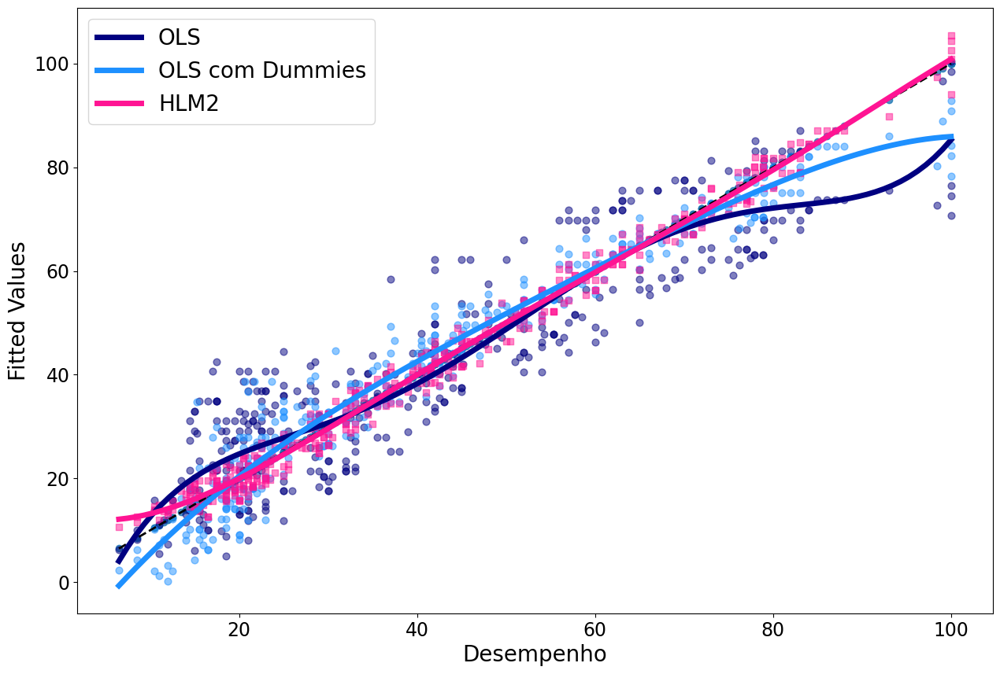


## HLM3 - ESTIMAÇÃO DE MODELOS HIERÁRQUICOS LINEARES DE TRÊS NÍVEIS COM MEDIDAS REPETIDAS

notebook >>> aluno_escola2.ipynb

O que são medidas repetidas?
Estou monitorando a mesma pessoa ao longo do tempo.
Painel longitudinal - cap. 16 do livro Manual de Análise de Dados

### Estimação do modelo nulo HLM3
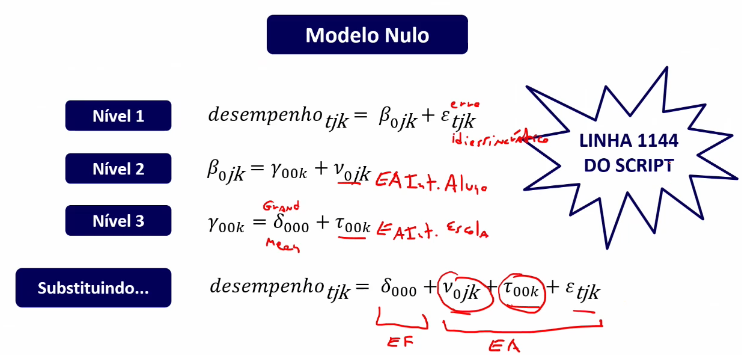

### ESTIMAÇÃO DO MODELO HLM3 COM TENDÊNCIA LINEAR E INTERCEPTOS E INCLINAÇÕES ALEATÓRIOS 

$desempenho\_{tjk} = \delta\_{000} + \delta\_{100} \cdot mes\_{jk} +$ 

$v\_{0jk} + v\_{1jk} \cdot mes\_{jk} + \tau\_{00k} + \tau\_{10k} \cdot mes\_{jk} + \varepsilon\_{tjk}$

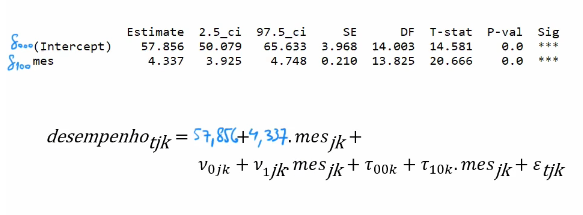


### ESTIMAÇÃO DO MODELO HLM3 COM TENDÊNCIA LINEAR, INTERCEPTOS E INCLINAÇÕES ALEATÓRIOS E AS VARIÁVEIS 'ativ' DE NÍVEL 2 E 'text' DE NÍVEL 3 


