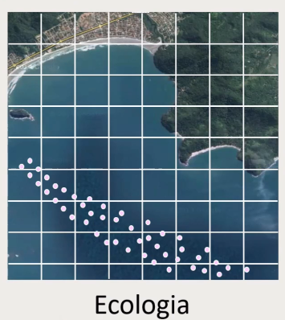

### Modelos Lineares Generalizados (GLM) - Modelos para Dados de Contagem I e II

Minhas anotações da aula ministrada pelo prof. Fávero

| Modelo de Regressão | Característica da variável dependente | Distribuição |
| --- | --- | --- |
| Poisson | Quantitativa com valores inteiros e não negativos (dados de contagem) | Poisson |
| Binomial Negativo | Quantitativa com valores inteiros e não negativos (dados de contagem) | Poisson-Gama |
--------

Dados de contagem
- quanti
- valores inteiros (discretos)
- não negativos (conta o 0)
- para determinada exposição (unidade temporal, espacial, social, etc...)

Exemplos de utilização:




- pin study
- localização de imóveis a venda
- quadrículas definidas por Geohashing

### Distribuição Poisson
- quando tem a cauda longa é Poisson-Gama (binomial negativa)
- aqui vamos contar o número de tentativas necessárias para alcançar um número fixo de sucessos (contagem)
- a média é igual a variância


$\lambda$ é a esperança de Y

### Teste de Superdispersão de Cameron e Trivedi


Cameron e Trivedi (1990) salientam que, se ocorrer o fenômeno da superdispersão nos dados,
o parâmetro estimado  deste modelo auxiliar sem intercepto será estatisticamente diferente
de zero, a determinado nível de significância (5%, usualmente).


### DISTRIBUIÇÃO BINOMIAL NEGATIVA (Poissom-Gama)


- theta: parâmetro forma
- delta: parâmetro taxa de decaimento

Modelo NB2
- binomial negativo type 2


Modelo Poissom-Game ou Binomial Negativo


- Uma dica: você pode rodar direto o modelo NB2, considerando a superdispersão. Se tiver superdispersão, vai funcionar melhor do que a Poisson, se não tiver, para valores menores ele funciona do mesmo jeito.

### ESTIMAÇÕES MUITO PRÓXIMAS PARA POISSON E BNEG SEM SUPERDISPERSÃO!


### A DISTRIBUIÇÃO ZERO-INFLATED POISSON (ZIP)


- modelo Poisson inflacionado de zeros é estimado a partir da combinação de uma distribuição Bernoulli com uma distribuição Poisson
- um modelo binomial negativo inflacionado de zeros é estimado por meio da combinação de uma distribuição Bernoulli com uma distribuição Poisson-Gama
- A definição sobre a existência ou não de uma quantidade excessiva de zeros na variável dependente Y é elaborada por meio de um teste específico, conhecido por **teste de Vuong** (1989)


Poisson inflacionados de zeros apresentam dois processos
geradores de zeros, sendo:
- um devido à distribuição binária (neste caso, são gerados os chamados zeros estruturais)
- outro devido à distribuição Poisson (nesta situação, são gerados dados de contagem, entre os quais os chamados zeros amostrais)
- não tem stepwise para zero inflated
- mas tem stepwise para logit, se for necessário, utilize-a para identificar qual preditora talvez não faça sentido para o seu modelo


## A DISTRIBUIÇÃO ZERO-INFLATED BINOMIAL NEGATIVA (ZINB) - PARTE CONCEITUAL


### ESTIMAÇÃO DO MODELO ZERO-INFLATED BINOMIAL NEGATIVO (ZINB)

### Escolha do modelo


| Verificação                                    | Poisson | Binomial Negativo | Poisson Inflacionado de Zeros (ZIP) | Binomial Negativo Inflacionado de Zeros (ZINB) |
|------------------------------------------------|---------|------------------|------------------------------------|-----------------------------------------------|
| Superdispersão nos Dados da Variável Dependente | Não     | Sim              | Não                                | Sim                                           |
| Quantidade Excessiva de Zeros na Variável Dependente | Não     | Não              | Sim                                | Sim                                           |

### Cheat sheet dos modelos vistos


### **Regression Models in Python (using `statsmodels`)**

---

### **1. OLS (Ordinary Least Squares)**

- **Model**: Linear regression model for continuous dependent variables.
- **Usage**:
  ```python
  sm.OLS.from_formula()
  ```

---

### **2. Logit (Logistic Regression)**

- **Model**: Logistic regression for binary outcomes (0/1).
- **Usage**:
  ```python
  sm.LOGIT.from_formula()
  ```

---

### **3. MLogit (Multinomial Logistic Regression)**

- **Model**: Multinomial logistic regression for categorical outcomes with more than two categories.
- **Usage**:
  ```python
  MNLogit() -> sm.discrete.discrete_model
  ```

---

### **4. GLM (Generalized Linear Models)**

  GLM provides a general framework to build models for various types of distributions (not just normal like in OLS).

---

#### **a. Poisson Regression**

- **Model**: Used for count data (non-negative integers).
- **Usage**:
  ```python
  smf.glm(..., family=sm.families.Poisson())
  ```

---

#### **b. Negative Binomial Regression**

- **Model**: Used for count data when there is overdispersion (variance > mean).
- **Usage**:
  ```python
  smf.glm(..., family=sm.families.NegativeBinomial(alpha=ϕ))
  ```

---

### **5. Zero-Inflated Models**

#### **a. ZIP (Zero-Inflated Poisson)**

- **Model**: Poisson model with an added mechanism to account for excess zeros in the data.
- **Usage**:
  ```python
  sm.ZeroInflatedPoisson
  ```

---

#### **b. ZINB (Zero-Inflated Negative Binomial)**

- **Model**: Negative binomial model with a mechanism to account for excess zeros in the data.
- **Usage**:
  ```python
  sm.ZeroInflatedNegativeBinomialP
  ```

---

### **Key Notes:**
- **OLS**: Used for continuous outcomes, assumes normal distribution.
- **Logit**: For binary outcomes.
- **MLogit**: For categorical outcomes with more than two categories.
- **Poisson/Negative Binomial**: Count data models.
- **ZIP/ZINB**: Models that handle count data with excess zeros.


